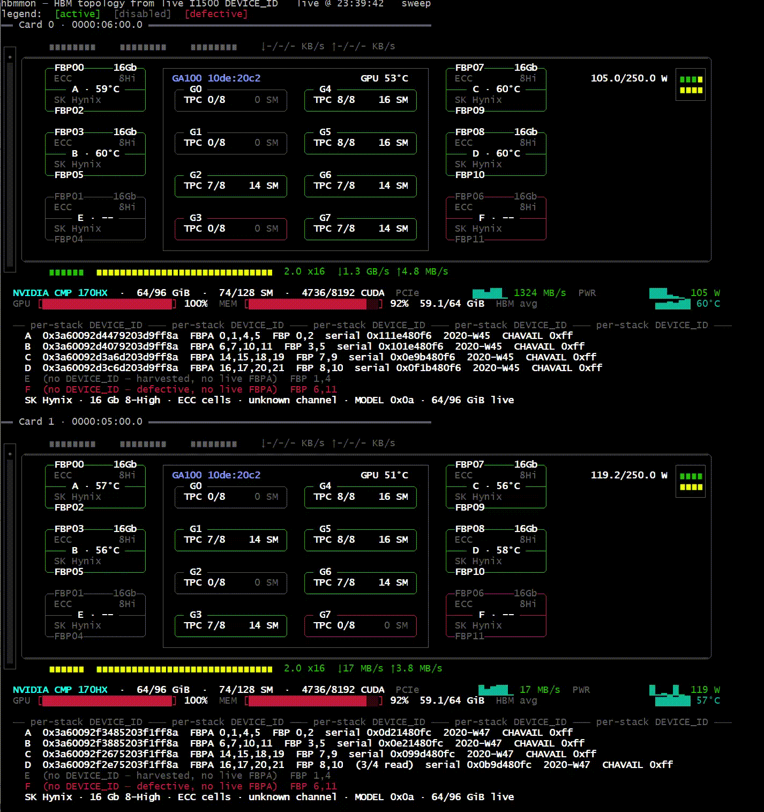

# hbmmon

Card monitor for the NVIDIA CMP 170HX (GA100) whose HBM facts are
**derived from the live hardware**, not hardcoded:

- **FBPA → stack map** — live FBPAs grouped by identical 82-bit
  `DEVICE_ID`, read per FBPA over the I1500 debug
  bridge at startup;
- **vendor / density / stack height / date code / serial / CHAVAIL / ECC
  / model** — decoded from that `DEVICE_ID`;
- **capacity** — density × dies per stack, cross-checked against
  nvidia-smi's exposed total;
- **live / harvested / defective FBP/stack** — the self-describing CFG1
  unicast map + the OPT_FBP fuses;
- **per-stack temperature** — the FB Falcon's own latched TEMPERATURE
  poll, one per FBPA;
- plus the full card view: 8 GPCs colored by fuses, PCIe link gen/width
  + throughput fingers, NVLink pad groups from the fuses, 8-pin power,
  nvtop-style stats panel with sparklines in live mode.

## Default run

```
sudo python3 ./hbmmon.py          # startup DEVICE_ID sweep + live map (2 s refresh)
```

At startup, **one** sweep runs (never per refresh): per live FBPA the
signed-off §11.8 recipe — save INSTR/MODE, arm MODE=0x52 (stream) +
WIR 0x0F0E (all channels + DEVICE_ID), settle, read 6 words, restore +
verify — 4 register writes per FBPA. After **every** FBPA the HBM
sentinels (`FBPA_NUM_ACTIVE`, `FBPA_TRAINING`) and dmesg Xids are diffed
against the pre-sweep baseline and the sweep **aborts on any change**
(then: stop and reboot the GPU). Undecoded FBPAs are re-taken (2
retakes) and re-swept in further rounds (3) under a global budget of 96
arm-captures — the capture failure modes (Falcon ISR re-arming the WIR
mid-capture, inter-burst idle-word reads) are stochastic, so each pass
is a fresh sample.

The sweep needs the SEC2 GSP booter's I1500 PLM opens installed (the
custom 610.43.02 driver on this box has them); without them the writes
are source-dropped and every capture reports DROPPED.

Options:

```
sudo python3 ./hbmmon.py --once        sweep + a single frame, no refresh loop
sudo python3 ./hbmmon.py --read-only   no sweep: BAR0 reads only, identity '?'
sudo python3 ./hbmmon.py --ids         print the per-stack Table 99 table and exit
sudo python3 ./hbmmon.py --live 1      1 s refresh
sudo python3 ./hbmmon.py --card 0 --no-color
sudo python3 ./hbmmon.py --mock        synthetic 170HX snapshot, no hardware
```

`--write-ok` is accepted for compatibility but is a no-op — the sweep is
the default; `--read-only` is the escape hatch.

## Layout

| file          | what |
|---------------|------|
| `hbmmon.py`   | the tool: sweep, topology derivation, drawing, live loop |
| `hbmmap.py`   | shared library: canvas, card/die geometry, nvidia-smi collection, `--mock` snapshot, `/dev/gpcprobe` access |
| `gpc_probe.py`| `/dev/gpcprobe` ioctl constants + the I1500 WDR capture engine (`wdr_arm_capture`, sentinels, Xid diff) |
| `gpcprobe.c`  | kernel module: BAR0 ioremap, 32-bit reads + the allowlisted I1500 writes |
| `Makefile`    | builds `gpcprobe.ko` against the running kernel |

Self-contained: nothing is imported from outside this directory.

## Install

```
make                # builds gpcprobe.ko (needs kernel headers)
sudo insmod gpcprobe.ko  # creates /dev/gpcprobe (root, 0600)
```

Requires `nvidia-smi` on PATH (the driver's own tool; any working
install) and root for the ioctl device. The module is read-only except
the I1500 INSTR/MODE control registers, which the kernel enforces —
everything else is reject-with-EPERM.

## Safety

- The sweep arms **read-type 1500 instructions only** (0E DEVICE_ID);
  the only BAR0 writes it issues are to the per-aperture INSTR/MODE
  control registers, and the kernel module hard-allowlists exactly
  those — the DATA latch (`+0x3CBC`) is not writable from the host. A
  DATA-latch write is the MR-write path, and the 2026-09-25 canaries
  showed it wedges the 1500 bridge card-wide until reboot, so it stays
  out of this tool's surface entirely.
- Sentinel + Xid gating after every FBPA; abort leaves the registers
  restored (the recipe restores INSTR then MODE before the check).
- `--read-only` / `--mock` issue no writes at all.

